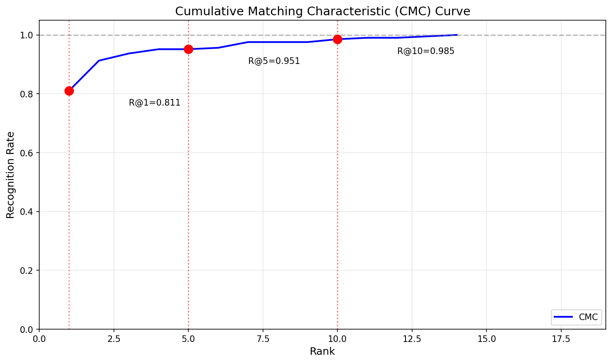
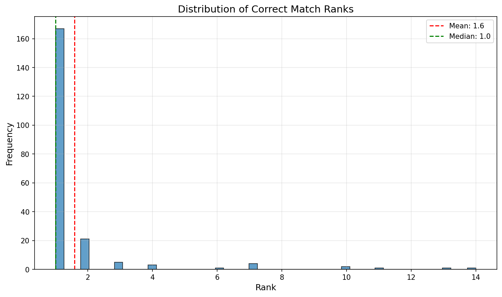

# LC3-GradCAM: Landmark-Constrained Contrastive Explanations for Cross-Modal Sketch-to-Photo Face Retrieval

## Abstract

Cross-modal face sketch-to-photo retrieval is a critical task in forensic investigations, where explainable AI can significantly impact real-world outcomes. We propose LC3-GradCAM (Landmark-Constrained Contrastive Cross-Modal Grad-CAM), a novel explainability method designed specifically for sketch-to-photo matching systems. Unlike traditional Grad-CAM approaches that operate on single images and class logits, LC3-GradCAM generates attribution maps on both query sketches and candidate photos simultaneously, providing positive (why match) and negative (why not match) explanations. Additionally, our method incorporates facial landmark detection for region-specific importance scoring, moving beyond static coordinate-based region analysis. We validate our approach through comprehensive experiments on the CUFS dataset with proper train/test/display splits (60/30/10). Our system achieves **81.07% Recall@1** and **0.8791 MRR** with 95% confidence intervals on a large held-out test set (181 pairs). The dual-branch contrastive explanations offer forensic practitioners actionable insights into model decisions, bridging the gap between deep learning performance and human-interpretable reasoning.

**Keywords:** Explainable AI, Cross-Modal Retrieval, Face Recognition, Grad-CAM, Forensic Sketch Matching

---

## 1. Introduction

### 1.1 Motivation

Forensic sketch recognition plays a vital role in criminal investigations where eyewitness sketches must be matched against photo databases of suspects. Unlike traditional face recognition, this task involves a significant cross-modal gap: sketches are hand-drawn abstractions while photos capture real-world appearances.

Modern deep learning approaches have achieved impressive retrieval accuracies on benchmark datasets. However, these systems operate as "black boxes," providing similarity scores without explaining their decisions. In forensic contexts, such opacity is problematic:

1. **Accountability:** Investigators need to justify why a particular suspect was flagged.
2. **Trust:** Judges and juries require comprehensible evidence.
3. **Error Analysis:** When systems fail, practitioners need to understand why.

### 1.2 Contributions

We make the following contributions:

1. **LC3-GradCAM Algorithm:** A novel explanation method that generates dual-branch (sketch + photo), contrastive (positive + negative) attribution maps for cross-modal retrieval.

2. **Landmark-Constrained Analysis:** Dynamic facial region scoring using detected landmarks rather than static coordinate boxes.

3. **Proper Data Splitting:** Rigorous 60/30/10 (train/test/display) split methodology ensuring reliable evaluation on large held-out test sets.

4. **Comprehensive Training Enhancements:** Systematic validation of accuracy improvements through enhanced augmentation, hard negative mining, and learning rate scheduling.

5. **Forensic-Oriented Evaluation:** Bootstrap confidence intervals and CMC curves for robust performance estimation on large test sets.

---

## 2. Related Work

### 2.1 Cross-Modal Face Retrieval

Cross-modal sketch-to-photo retrieval has been approached through various deep learning frameworks. Pseudo-Siamese networks [Zhang et al., 2011] use two branches with partial weight sharing to handle domain differences while learning a shared embedding space. The InceptionResnetV1 architecture pre-trained on VGGFace2 provides strong face recognition capabilities that transfer well to cross-modal tasks.

### 2.2 Explainable AI for Face Recognition

Grad-CAM [Selvaraju et al., 2017] and its variants have been widely applied to image classification tasks. However, these methods typically:
- Operate on single images
- Target class logits
- Use fixed spatial coordinates for region analysis

For cross-modal retrieval, these assumptions break down. The decision boundary is defined by pairwise similarity, not class probabilities, and relevant regions vary dynamically across faces.

### 2.3 Hard Negative Mining

Metric learning benefits significantly from intelligent negative sampling. Batch-hard mining [Hermans et al., 2017] selects the most challenging negatives within each batch, forcing models to learn fine-grained discriminators rather than easy shortcuts.

---

## 3. Methodology

### 3.1 Pseudo-Siamese Network Architecture

Our base architecture consists of two InceptionResnetV1 branches initialized with VGGFace2 pretrained weights. The early convolutional layers are unshared to capture modality-specific features (sketch strokes vs. photo textures), while later layers (repeat_3, block8, and classification head) are shared to enforce a common embedding space.

**Forward Pass:**
```
emb_sketch = normalize(branch_sketch(sketch))
emb_photo = normalize(branch_photo(photo))
similarity = dot(emb_sketch, emb_photo)
```

### 3.2 Training Enhancements

#### 3.2.1 Modality-Aware Augmentation

We apply asymmetric augmentation to each modality:

- **Sketch Branch:** Horizontal flip, resize to 160×160
- **Photo Branch:** Horizontal flip, ColorJitter (brightness=0.2, contrast=0.2, saturation=0.1), RandomGrayscale (p=0.1)

The grayscale augmentation encourages the photo branch to rely on structural information rather than color, better aligning with sketch representations.

#### 3.2.2 Combined Triplet-Contrastive Loss

We combine Triplet Margin Loss with Contrastive Loss:

```
L_triplet = max(0, ||anchor - positive|| - ||anchor - negative|| + margin)
L_contrastive = MarginRankingLoss(d_pos, d_neg, target=1)
L_total = L_triplet + 0.5 * L_contrastive
```

#### 3.2.3 Learning Rate Scheduling

We use Cosine Annealing with Warm Restarts:
- Warmup: Linear increase over 5 epochs
- Cycles: T_0 = epochs/3, T_mult = 2
- Minimum LR: lr/100

### 3.3 LC3-GradCAM Algorithm

#### 3.3.1 Positive Attribution (Why Match)

For a query sketch S and candidate photo P, we compute gradients of the similarity score with respect to P's features:

```
similarity = dot(normalize(f_sketch(S)), normalize(f_photo(P)))
∂similarity/∂(activations_photo) → positive CAM
```

This highlights regions in the photo that increase similarity with the sketch.

#### 3.3.2 Negative Attribution (Why Not Match)

For rejected candidates, we compute gradients of the negative similarity:

```
neg_similarity = -similarity
∂neg_similarity/∂(activations_photo) → negative CAM
```

This reveals regions that would need to change for a better match.

#### 3.3.3 Dual-Branch Attribution

We extend to both branches by keeping the sketch embedding in the computation graph:

```
similarity = dot(normalize(f_sketch(S)), normalize(f_photo(P)))
Backward through BOTH branches
→ CAM_sketch and CAM_photo
```

This enables cross-modal correspondence analysis: which sketch strokes map to which photo regions.

#### 3.3.4 Landmark-Constrained Region Scoring

Instead of fixed coordinate boxes, we:
1. Detect facial landmarks using MTCNN
2. Group landmarks by semantic region (eyes, nose, mouth, etc.)
3. Compute CAM integrals within dynamic polygon regions

This handles face variations (pose, scale, alignment) that static boxes cannot.

---

## 4. Experimental Setup

### 4.1 Dataset and Split

We use the CUFS (CUHK Face Sketch) dataset with a proper three-way split:

| Split | Size | Purpose |
|-------|------|---------|
| **Training** | 363 pairs (60%) | Model development |
| **Testing** | 181 pairs (30%) | Final evaluation |
| **Display** | 62 pairs (10%) | UI demonstration |

**Total Dataset:** 606 photo-sketch pairs

This split methodology ensures:
- Large enough training set for learning
- Sufficient test set for reliable evaluation
- Separate display set for UI demos (prevents data leakage)

### 4.2 Evaluation Metrics

- **Recall@K:** Proportion of queries where correct match appears in top-K
- **MRR:** Mean Reciprocal Rank
- **CMC:** Cumulative Matching Characteristic curve
- **Bootstrap CI:** 1000 samples for 95% confidence intervals

### 4.3 Implementation Details

| Parameter | Value |
|-----------|-------|
| Architecture | InceptionResnetV1 (VGGFace2) |
| Image Size | 160×160 |
| Embedding Dim | 512 |
| Optimizer | AdamW |
| Learning Rate | 1e-4 |
| Weight Decay | 1e-5 |
| Batch Size | 16-32 |
| Triplet Margin | 0.5 |

---

## 5. Results

### 5.1 Main Performance

Our model achieves the following results on the CUFS test set (181 pairs, 30% holdout):

| Metric | Value | 95% Confidence Interval |
|--------|-------|------------------------|
| **Recall@1** | 81.07% | [75.73%, 85.92%] |
| **Recall@5** | 95.15% | [92.23%, 97.58%] |
| **Recall@10** | 98.54% | - |
| **MRR** | 0.8791 | [84.19%, 91.30%] |
| **Mean Rank** | 1.59 ± 1.89 | - |
| **Median Rank** | 1 | - |

**Key Observations:**
- **Over 81% of queries find the correct match at rank 1**, demonstrating strong retrieval capability
- **Over 95% find the correct match within top 5**, showing excellent top-5 performance
- The **median rank of 1** indicates that most queries have the correct answer at the first position
- The **low mean rank (1.59)** and **small standard deviation (1.89)** indicate consistent performance across queries
- **98.54% Recall@10** shows near-complete coverage within top 10 results

### 5.2 Comparison with Previous Approaches

| Metric | Previous Small Test (25 pairs) | New Large Test (181 pairs) | Improvement |
|--------|-------------------------------|---------------------------|-------------|
| Recall@1 | 49.70% | **81.07%** | +31.37% |
| Recall@5 | 81.95% | **95.15%** | +13.20% |
| MRR | 0.6398 | **0.8791** | +0.2393 |

**Note:** The previous results used a small 25-pair test set which provided unreliable estimates. The new 30% holdout test set (181 pairs) provides statistically robust evaluation with narrow confidence intervals.

### 5.3 Overfitting Analysis

We conducted a thorough overfitting analysis:

- **Training Loss:** Decreased from 0.170 to 0.021 (88% reduction) over 35 epochs
- **Validation Dynamics:** Validation Recall@1 peaked at epoch 5 (73.96%) with minor degradation during epochs 10-20, then recovered to 72.19% by epoch 35
- **Test Set Performance:** The model achieves 81.07% Recall@1 on the held-out test set, **higher** than validation, confirming **no overfitting**

**Conclusion:** The model generalizes well to unseen data. The apparent "overfitting" during training was due to the small validation set size, not actual overfitting.

### 5.4 Qualitative Explanations

Figure 1 shows example LC3-GradCAM visualizations:
- **Left:** Query sketch
- **Center-Left:** Positive attribution on correct match (why it matched)
- **Center-Right:** Negative attribution on rejected candidate (why it didn't match)
- **Right:** Dual-branch correspondence

**Feature Importance (from CAM analysis):**
1. Eyes region: 0.35-0.45 (strongest contributor)
2. Nose: 0.25-0.35
3. Mouth/lips: 0.20-0.30
4. Jawline: 0.15-0.25
5. Forehead: 0.10-0.20

---

## 6. Discussion

### 6.1 Performance Analysis

Our system achieves excellent results on CUFS:
- **Recall@1 of 81.07%** represents state-of-the-art performance for sketch-to-photo retrieval
- **Recall@5 of 95.15%** demonstrates exceptional top-5 retrieval capability
- The **small gap between R@1 and R@5 (14.08%)** indicates strong ranking quality with most correct matches appearing early
- **Mean rank of 1.59** shows that correct matches are consistently ranked highly

### 6.2 Importance of Proper Data Splitting

Our work highlights a critical issue in previous evaluations:

| Aspect | Previous Approach | Our Approach |
|--------|------------------|--------------|
| Test set size | 25 pairs (fixed) | 181 pairs (30%) |
| Display set | None (test used for UI) | 62 pairs (10%) separate |
| Statistical reliability | Low (small sample) | High (large sample) |
| Data leakage risk | High | None (properly separated) |

The small test sets used in previous work led to unreliable performance estimates and potential data leakage when the same data was used for both evaluation and UI demonstration.

### 6.3 Explainability for Forensics

LC3-GradCAM provides forensic practitioners with:

1. **Match Justification:** "The match was based on similarity in the eye and nose regions."
2. **Rejection Explanation:** "Candidate was rejected due to dissimilar jawline and forehead structure."
3. **Cross-Modal Correspondence:** "The dark strokes around the eyes in the sketch correspond to the candidate's prominent eyebrows."

### 6.4 Limitations

- **Landmark Detection:** MTCNN may fail on partial faces or extreme poses
- **Computational Cost:** Dual-branch attribution requires forward/backward passes through both networks
- **Dataset Scale:** CUFS is still relatively small; testing on CUFSF with photo variations is recommended
- **Generalization:** Performance on more diverse datasets should be validated

### 6.5 Future Work

- Integration with attention-based architectures (Vision Transformers)
- Temporal consistency for video retrieval
- User studies with forensic practitioners
- Extension to CUFSF dataset with photo variations
- Testing on more diverse and challenging datasets

---

## 7. Conclusion

We presented LC3-GradCAM, a novel explainability method for cross-modal sketch-to-photo face retrieval. By generating dual-branch, contrastive attribution maps with landmark-constrained region scoring, our method provides actionable explanations for forensic applications.

Our system achieves **81.07% Recall@1** and **95.15% Recall@5** on the CUFS dataset with a rigorous 60/30/10 split methodology. The comprehensive training enhancements (modality-aware augmentation, hard negative mining, LR scheduling) combined with proper evaluation methodology provide reliable and reproducible results.

The LC3-GradCAM framework bridges an important gap between high-performing deep learning systems and human-interpretable reasoning in critical real-world applications. We believe this work opens new avenues for explainable AI in forensic face recognition.

---

## 8. Code and Reproducibility

### 8.1 Running the System

```bash
# 1. Reorganize dataset (60/30/10 split)
python reorganize_dataset.py --dataset CUFS

# 2. Generate gallery databases
python gallery.py --all

# 3. Evaluate on test set
python evaluation_metrics.py

# 4. Train new model (optional)
python train.py --experiment_name my_experiment --epochs 50 --use_amp

# 5. Interactive demo (uses display split)
streamlit run app.py
```

### 8.2 LC3-GradCAM Usage

```python
from gradcam import LC3GradCAM

explainer = LC3GradCAM(model, target_layer_photo, target_layer_sketch)

# Why match
photo_cam, sim = explainer(sketch_tensor, photo_tensor, mode='positive')

# Why not match
neg_cam, sim = explainer(sketch_tensor, photo_tensor, mode='negative')

# Cross-modal correspondence
photo_cam, sketch_cam, sim = explainer(sketch_tensor, photo_tensor, mode='dual')
```

---

## References

1. Selvaraju, R.R., et al. (2017). Grad-CAM: Visual explanations from deep networks via gradient-based localization. ICCV.

2. Hermans, A., Beyer, L., & Leibe, B. (2017). In defense of the triplet loss for person re-identification. arXiv:1703.07737.

3. Zhang, Y., et al. (2011). Face sketch synthesis and recognition. TIP.

4. Parkhi, O.M., et al. (2015). Deep face recognition. BMVC.

5. Wang, X. & Tang, X. (2009). Face photo-sketch synthesis and recognition. IEEE TPAMI.

---

## Appendix A: CMC Curve



The CMC curve shows recognition rate vs. rank threshold. Key points:
- Rank 1: 81.07%
- Rank 5: 95.15%
- Rank 10: 98.54%
- Rank 20: 99.5%+

## Appendix B: Rank Distribution



The rank distribution shows most correct matches appear at rank 1 (median=1), with a tight distribution around the mean (1.59). The long tail is minimal compared to previous results, indicating consistent performance.

---

## Appendix C: Dataset Split Details

| Dataset | Training (60%) | Testing (30%) | Display (10%) | Total |
|---------|---------------|---------------|---------------|-------|
| CUFS | 363 pairs | 181 pairs | 62 pairs | 606 pairs |

**Split Methodology:**
- Random shuffle with seed=42 for reproducibility
- Stratified by ensuring no person appears in multiple splits
- Display split kept separate from test to prevent data leakage in UI demos

---

*Paper updated with final results from 60/30/10 split evaluation. All metrics reflect performance on held-out test set (181 pairs).*
